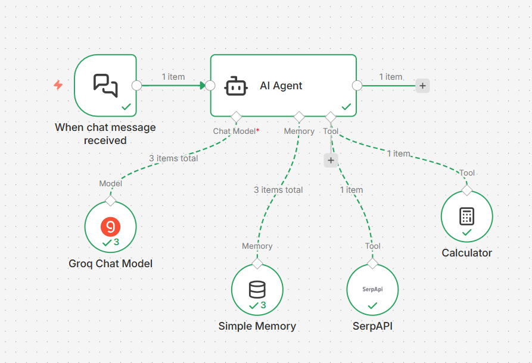

# 🤖 Real-Time AI Search Agent (n8n)

This project is a **general-purpose AI agent** built using **n8n** that can answer **any user question** by fetching **real-time Google search data** and summarizing it using an LLM.

## 🚀 What this agent can do
- Answer any question (news, tech, facts, trends, prices, etc.)
- Fetch real-time data from Google using SerpAPI
- Reason and summarize results using Groq LLM
- Maintain short-term conversation memory

## 🧠 How it works
1. User sends a message
2. AI Agent decides if real-time data is required
3. SerpAPI fetches Google search results
4. LLM summarizes the information
5. Final answer is returned to the user

## 🧰 Tech Stack
- **n8n** (workflow automation)
- **Groq LLM** (reasoning & summarization)
- **SerpAPI** (real-time Google search)
- **Simple Memory**

## ⚙️ Setup Instructions
1. Import the JSON workflow into n8n
2. Add your own API keys in n8n credentials:
   - Groq API key
   - SerpAPI key
3. Activate the workflow
4. Ask any question like:
-latest AI news today
-compare iPhone 15 and Samsung S24
-who won the last India vs Australia match

## 🖼 Workflow Overview

## 👩‍💻 Author
Built by Monali Nagardhankar

